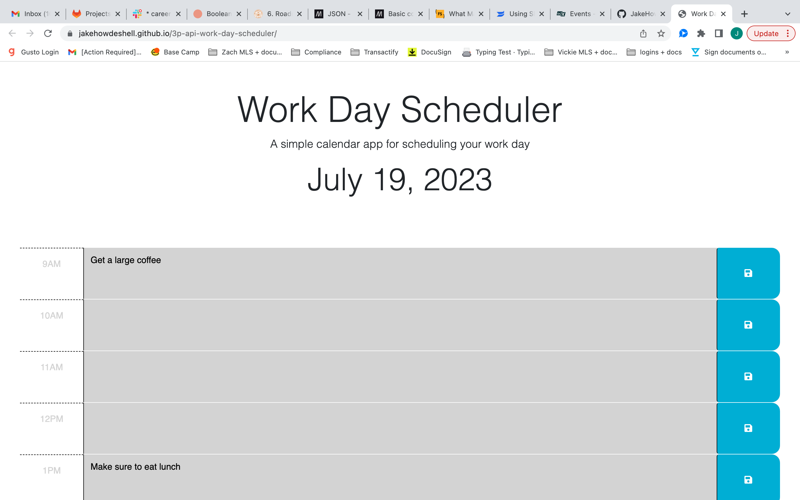
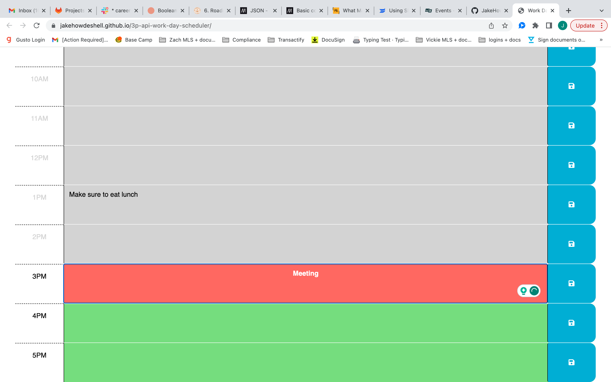

## Project Title

Third party API Work Day Scheduler

## Project Description

AS AN employee with a busy schedule
I WANT to add important events to a daily planner
SO THAT I can manage my time effectively

GIVEN I am using a daily planner to create a schedule
WHEN I open the planner
THEN the current day is displayed at the top of the calendar

Using Dayjs() a variable was set to the current date formatted to display the month day and then year. That variable was then set equal to the id in the header displaying the current date.

WHEN I scroll down
THEN I am presented with time blocks for standard business hours of 9am to 5pm

Individual divisions were created inside the body of the HTML page with the same formatting as the starter code with seperate id's so they could be called individually.

WHEN I view the time blocks for that day
THEN each time block is color-coded to indicate whether it is in the past, present, or future

The class time-block, located on each HTML division containig the hours of the work day, was used to create a .each() Jquery function. That function ran through each of those instances and compaired the global variable containing the current hour to the portion of the id containing the hour long time block that division represented. If those times were equal then it applied a new class called present that changes the background to red, as well as a class called white-text that changes the discription text to white. For the sections where the current hour is less than the time block the present class is removed and the future class is applied. Lastly if the current hour is greater than the time block the future class is removed and past class is applied which changes the background to grey, as well as the time-display class which greys out the hours of the day that have past.

WHEN I click into a time block
THEN I can enter an event

The HTML element textarea was used to allow the users to enter an event into that time slot.

WHEN I click the save button for that time block
THEN the text for that event is saved in local storage

A .click function was added to the saveBtn class that creates two variables, one is the value of the discription and the other is the value of the time element of the id where the discription was added. These two values are then stored in local storage.

WHEN I refresh the page
THEN the saved events persist

The items stored in local storage are then targeted using a key and presented on the page as values at the location of that key.

## ScreenShots

## Deployed Website

https://jakehowdeshell.github.io/3p-api-work-day-scheduler/
